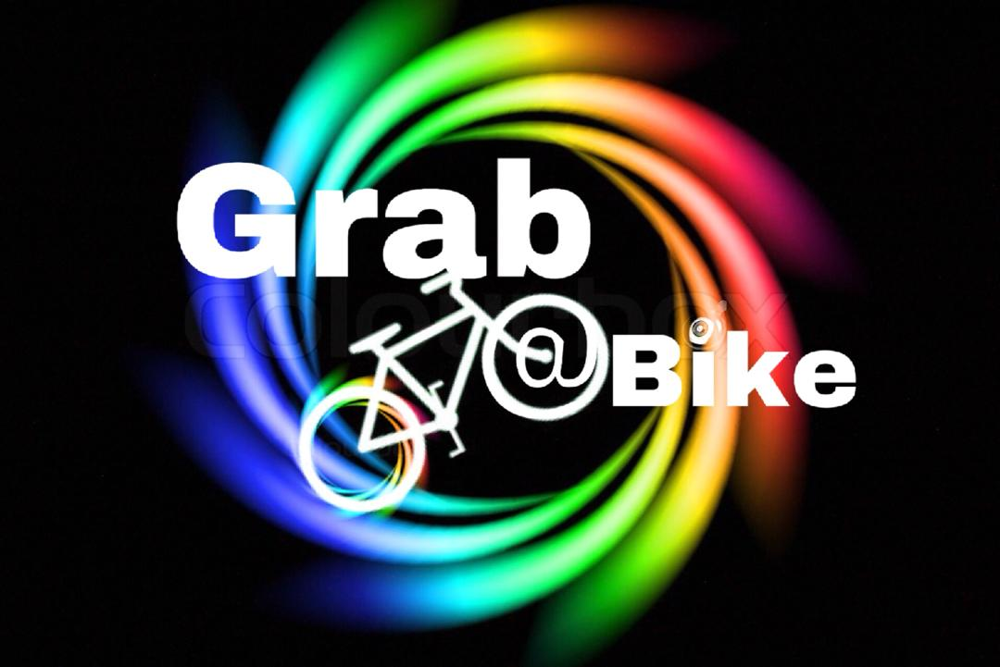
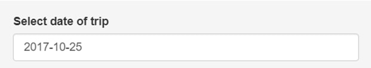
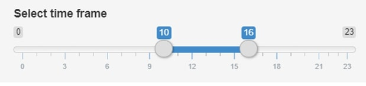
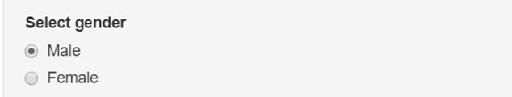
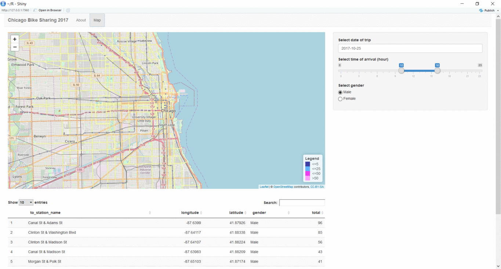

<h1>
 Grab a Bike App
</h1>

An interactive app that showcases the results of where and when bikers loved to ride around Chicago city in 2017.
 
 
<h3>
To bike or not to bike
</h3>
Naturally, bikers have different preferences and reasons for choosing to cycle. Some may ride the bike to help them reach their destination and some may use it as a way to tour the city, for sightseeing.Whatever their preferences and reasons may be, the Grab a Bike app plans to help you visualize and explore the 2017 Chicago City cycling trends .
    
    
<h3>
3 simple steps to navigate the app
</h3>

**Step 1**:  

     
**Step 2**:  

   
**Step 3**:  

   
 
 
<h3>
With that you are ready to explore the map
</h3>
The coloured markers are indicators of bike station location and popularity level
  <ul>
  <li>Dark Blue: Around 5 bike trips or less</li>
  <li>Light Blue: Around 25 bike trips or less </li>
  <li>Purple: Around 50 bike trips or less </li>
  <li>Light Purple: More than 50 bike trips </li>
</ul>

  
 
 
 

**let's pedal on to the App tab**

